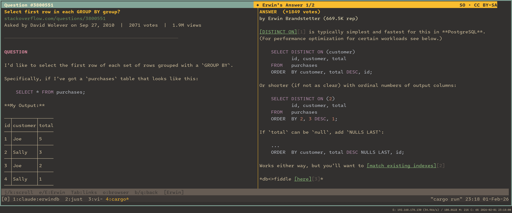
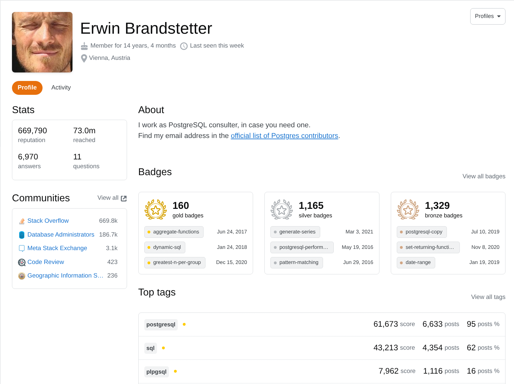

# ErwinDB

A TUI for browsing [Erwin Brandstetter's](https://stackoverflow.com/users/939860/erwin-brandstetter) Stack Overflow Q&A content.



## Why Erwin's Answers?



Erwin Brandstetter is a PostgreSQL consultant with ~670k reputation and ~7k answers on Stack Overflow.

Over the years, I've lost count of how often I've searched Stack Overflow for a Postgres question and ended up with an answer by Erwin Brandstetter that was exceptionally thorough and clear. I've become a better developer by learning from his responses.

When answering questions, he typically:

- Links to and quotes the PostgreSQL manual constantly, showing you exactly where features are documented
- Notes which features work in which Postgres versions, and updates old answers when new versions add capabilities
- Addresses edge cases you wouldn't think of—NULL handling, concurrency, race conditions
- Benchmarks multiple approaches with actual timing results

## Why This App?

ErwinDB lets you browse Erwin Brandstetter's answers offline and search them quickly from a TUI. It includes semantic search, syntax highlighting, one-key opening of links in your external browser, and an "Erwin mode" that prominently highlights his posts.

## Installation

### Cargo

```bash
cargo install erwindb
```

### Homebrew

```bash
brew install ahacop/tap/erwindb
```

### Nix

```bash
nix run github:ahacop/erwindb
# or
nix profile install github:ahacop/erwindb
```

### From source

```bash
git clone https://github.com/ahacop/erwindb
cd erwindb
cargo build --release
```

## Features

- Browse questions where Erwin Brandstetter has answered
- Fuzzy search on question titles
- Semantic search using ML embeddings
- Syntax-highlighted code blocks
- Dual-pane view (question + Erwin's answer side-by-side on wide terminals)

## Keyboard Shortcuts

### Question List

| Key       | Action                                           |
| --------- | ------------------------------------------------ |
| `j` / `↓` | Move down                                        |
| `k` / `↑` | Move up                                          |
| `g`       | Go to top                                        |
| `G`       | Go to bottom                                     |
| `Space`   | Page down                                        |
| `Ctrl+d`  | Half page down                                   |
| `Ctrl+u`  | Half page up                                     |
| `Enter`   | View question                                    |
| `/`       | Fuzzy search                                     |
| `?`       | Semantic search                                  |
| `Esc`     | Clear search                                     |
| `1-5`     | Sort by column (ID, Date, Score, Views, Answers) |
| `o`       | Open in browser                                  |
| `q`       | Quit                                             |

### Question Detail

| Key           | Action                                         |
| ------------- | ---------------------------------------------- |
| `j` / `↓`     | Scroll down                                    |
| `k` / `↑`     | Scroll up                                      |
| `g`           | Go to top                                      |
| `G`           | Go to bottom                                   |
| `Space` / `d` | Page down                                      |
| `u`           | Page up                                        |
| `e`           | Cycle to next Erwin answer / toggle Erwin pane |
| `E`           | Cycle to previous Erwin answer                 |
| `Tab`         | Focus next link                                |
| `Shift+Tab`   | Focus previous link                            |
| `o`           | Open focused link or question in browser       |
| `q` / `b`     | Back to list                                   |

## Demos

<video src="https://github.com/ahacop/erwindb/raw/main/.github/assets/demo.mp4" controls muted autoplay loop></video>

<details>
<summary>Fuzzy Search</summary>

<video src="https://github.com/ahacop/erwindb/raw/main/.github/assets/search.mp4" controls muted autoplay loop></video>

</details>

<details>
<summary>Semantic Search</summary>

<video src="https://github.com/ahacop/erwindb/raw/main/.github/assets/semantic-search.mp4" controls muted autoplay loop></video>

</details>

<details>
<summary>Erwin Mode</summary>

<video src="https://github.com/ahacop/erwindb/raw/main/.github/assets/erwin-mode.mp4" controls muted autoplay loop></video>

</details>

## Development

```bash
cargo build              # Debug build
cargo build --release    # Optimized build
cargo run                # Run the application
cargo fmt                # Format code
cargo clippy             # Lint checks
```

### Releasing

```bash
./scripts/release        # Bump patch version (0.9.4 -> 0.9.5)
./scripts/release 1.0.0  # Set specific version

git push origin main --tags  # Trigger release workflow
```

## License

This project has two separate licenses:

- **Code** (TUI, scraper, utilities): [GNU General Public License v3.0](LICENSE)
- **Data** (Stack Overflow content in the database): [CC BY-SA](LICENSE-DATA.md) - content from Stack Overflow is licensed under Creative Commons Attribution-ShareAlike, with the specific version (2.5, 3.0, or 4.0) depending on when it was originally posted
