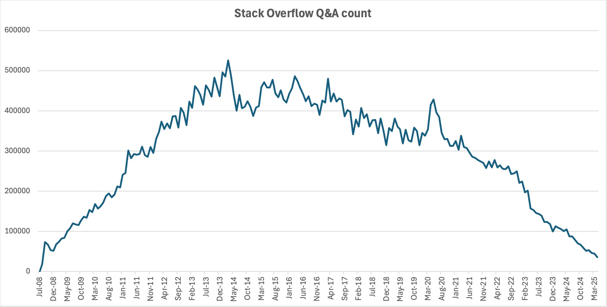

# ErwinDB

A TUI for browsing [Erwin Brandstetter's](https://stackoverflow.com/users/939860/erwin-brandstetter) Stack Overflow Q&A content.


Erwin Brandstetter is a PostgreSQL consultant based in Vienna, Austria with 670k+ reputation and nearly 7,000 answers on Stack Overflow. His answers are an invaluable resource for anyone working with PostgreSQL.

## Why This Exists



## Installation

### Cargo

```bash
cargo install erwindb
```

### Homebrew

```bash
brew install ahacop/tap/erwindb
```

### Nix

```bash
nix run github:ahacop/erwindb
# or
nix profile install github:ahacop/erwindb
```

### From source

```bash
git clone https://github.com/ahacop/erwindb
cd erwindb
cargo build --release
```

## Features

- Browse questions where Erwin Brandstetter has answered
- Fuzzy search on question titles
- Semantic search using ML embeddings
- Syntax-highlighted code blocks
- Dual-pane view (question + Erwin's answer side-by-side on wide terminals)

## Keyboard Shortcuts

### Question List

| Key | Action |
|-----|--------|
| `j` / `↓` | Move down |
| `k` / `↑` | Move up |
| `g` | Go to top |
| `G` | Go to bottom |
| `Space` | Page down |
| `Ctrl+d` | Half page down |
| `Ctrl+u` | Half page up |
| `Enter` | View question |
| `/` | Fuzzy search |
| `?` | Semantic search |
| `Esc` | Clear search |
| `1-5` | Sort by column (ID, Date, Score, Views, Answers) |
| `o` | Open in browser |
| `q` | Quit |

### Question Detail

| Key | Action |
|-----|--------|
| `j` / `↓` | Scroll down |
| `k` / `↑` | Scroll up |
| `g` | Go to top |
| `G` | Go to bottom |
| `Space` / `d` | Page down |
| `u` | Page up |
| `e` | Cycle to next Erwin answer / toggle Erwin pane |
| `E` | Cycle to previous Erwin answer |
| `Tab` | Focus next link |
| `Shift+Tab` | Focus previous link |
| `o` | Open focused link or question in browser |
| `q` / `b` | Back to list |

## License

This project has two separate licenses:

- **Code** (TUI, scraper, utilities): [GNU General Public License v3.0](LICENSE)
- **Data** (Stack Overflow content in the database): [CC BY-SA](LICENSE-DATA.md) - content from Stack Overflow is licensed under Creative Commons Attribution-ShareAlike, with the specific version (2.5, 3.0, or 4.0) depending on when it was originally posted
